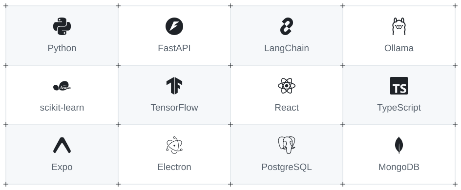

<!-- Profile graphics are included in assets/profile. -->

<picture>
  <source media="(prefers-color-scheme: dark)" srcset="./assets/profile/header-dark.svg">
  <source media="(prefers-color-scheme: light)" srcset="./assets/profile/header-light.svg">
  
</picture>

  

## Hi, I'm Ahmad

I build AI apps with Python and FastAPI. Most of my recent work is around RAG, research agents, and local LLMs. I also use React and React Native to build the interfaces.

One of my main projects is a desktop meeting and video assistant. It turns audio and video content into reports you can ask questions about, with the models running locally through Ollama.

[Portfolio](https://imahmad.vercel.app) &nbsp; / &nbsp; [Research assistant demo](https://researcharena.vercel.app)

 

<picture>
  <source media="(prefers-color-scheme: dark)" srcset="./assets/profile/separator-dark.svg">
  
</picture>

## Technical skills

<picture>
  <source media="(prefers-color-scheme: dark) and (max-width: 600px)" srcset="./assets/profile/tools-mobile-dark.svg">
  <source media="(prefers-color-scheme: light) and (max-width: 600px)" srcset="./assets/profile/tools-mobile-light.svg">
  <source media="(prefers-color-scheme: dark)" srcset="./assets/profile/tools-dark.svg">
  
</picture>

| Area | Languages, frameworks, and tools |
| :--- | :--- |
| Languages | Python, JavaScript, TypeScript, SQL |
| AI and retrieval | LangChain, ChromaDB, Ollama, Hugging Face |
| Machine learning and data | scikit-learn, TensorFlow, Pandas, NumPy, Jupyter |
| Backend frameworks | FastAPI, Node.js, Express |
| Web, mobile, and desktop | React, React Native, Next.js, Expo, Electron, Tailwind CSS, Vite |
| Databases and services | PostgreSQL, MongoDB, Supabase, Appwrite |
| Development and deployment | Git, AWS, Vercel |

 

<picture>
  <source media="(prefers-color-scheme: dark)" srcset="./assets/profile/separator-dark.svg">
  
</picture>

## Things I've built

<table>
  <tr>
    <td width="50%" valign="top">
      <a href="https://github.com/MAhmad25/Multi-Agent-Research-Assistant">
        <picture>
          <source media="(prefers-color-scheme: dark)" srcset="./assets/profile/card-research-dark.svg">
          
        </picture>
      </a>
      
Searches the web, reads sources, and checks the findings before writing a report. You can follow each step as it runs.

      
Python · FastAPI · LangChain · React

      
<a href="https://github.com/MAhmad25/Multi-Agent-Research-Assistant">Code</a> &nbsp; / &nbsp; <a href="https://researcharena.vercel.app">Live demo</a>

    </td>
    <td width="50%" valign="top">
      <a href="https://github.com/MAhmad25/AI-Meeting-Video-Assistant-with-RAG">
        <picture>
          <source media="(prefers-color-scheme: dark)" srcset="./assets/profile/card-meeting-dark.svg">
          
        </picture>
      </a>
      
A desktop app that turns meetings and YouTube content into reports, then answers questions about them using RAG and local models.

      
Electron · FastAPI · LangChain · Ollama

      
<a href="https://github.com/MAhmad25/AI-Meeting-Video-Assistant-with-RAG">Code</a>

    </td>
  </tr>
  <tr>
    <td width="50%" valign="top">
      <a href="https://github.com/MAhmad25/Sentiment-Analysis-App">
        <picture>
          <source media="(prefers-color-scheme: dark)" srcset="./assets/profile/card-sentiment-dark.svg">
          
        </picture>
      </a>
      
Type some text and see its predicted sentiment. A trained scikit-learn model handles the prediction behind a FastAPI endpoint.

      
scikit-learn · FastAPI · React · TypeScript

      
<a href="https://github.com/MAhmad25/Sentiment-Analysis-App">Code</a>

    </td>
    <td width="50%" valign="top">
      <a href="https://github.com/MAhmad25/Chat_with_Document_RAG">
        <picture>
          <source media="(prefers-color-scheme: dark)" srcset="./assets/profile/card-document-dark.svg">
          
        </picture>
      </a>
      
Upload a PDF and ask questions about it. The app retrieves relevant passages and uses them as context for the answer.

      
FastAPI · LangChain · ChromaDB · Mistral · React

      
<a href="https://github.com/MAhmad25/Chat_with_Document_RAG">Code</a>

    </td>
  </tr>
  <tr>
    <td width="50%" valign="top">
      <a href="https://github.com/MAhmad25/Next_Word_Predictor_LSTM_Model">
        <picture>
          <source media="(prefers-color-scheme: dark)" srcset="./assets/profile/card-next-word-dark.svg">
          
        </picture>
      </a>
      
An LSTM trained on Shakespeare's <em>Hamlet</em>. Give it a phrase and it predicts what comes next.

      
TensorFlow · Keras · Streamlit

      
<a href="https://github.com/MAhmad25/Next_Word_Predictor_LSTM_Model">Code</a>

    </td>
    <td width="50%" valign="top">
      <a href="https://github.com/MAhmad25/MoviesFlix-Native-Android-App">
        <picture>
          <source media="(prefers-color-scheme: dark)" srcset="./assets/profile/card-moviesflix-dark.svg">
          
        </picture>
      </a>
      
A React Native app for browsing movies and TV shows, exploring cast details, and watching trailers.

      
React Native · Expo · TypeScript · TMDB

      
<a href="https://github.com/MAhmad25/MoviesFlix-Native-Android-App">Code</a>

    </td>
  </tr>
</table>

## More projects and experiments

### AI and machine learning

| Project | What I worked on |
| :--- | :--- |
| [CineSage](https://github.com/MAhmad25/CineSage_Info_Extractor_GEN_AI) | Extracting movie information from text with an LLM |
| [Voice agent](https://github.com/MAhmad25/SimpleVoiceAgent-with-Eleven-Labs) | Speech input and voice responses with ElevenLabs |
| [Heart disease prediction](https://github.com/MAhmad25/HeartDiseases_Prediction_Model) | Comparing models on a heart disease dataset |
| [Ford car price prediction](https://github.com/MAhmad25/Ford_car_Price_Prediction_Model) | Regression for used car prices |
| [Movie recommendations](https://github.com/MAhmad25/Movie_Recommendation_Model) | Content-based recommendations |
| [CNN experiments](https://github.com/MAhmad25/CNN-Model) · [ANN experiments](https://github.com/MAhmad25/ANN-Model) | Image classification and neural network practice |
| [Classification models](https://github.com/MAhmad25/Classification-Models) · [Sentiment model](https://github.com/MAhmad25/Sentiment_Analysis_Model_using_NLP) | Training and comparing classifiers |
| [Unsupervised learning](https://github.com/MAhmad25/Unsupervised-Learning) | Clustering with K-means and DBSCAN |

### Web apps

[MoviesFlix](https://github.com/MAhmad25/TheMoviesFlix-Streaming-Platform) · [AI chat interface](https://github.com/MAhmad25/AI-Chat-Bot) · [Image gallery](https://github.com/MAhmad25/Image-Gallery) · [E-commerce app](https://github.com/MAhmad25/E-commerce-React-App) · [Education platform](https://github.com/MAhmad25/Education-Platform) · [Bank management app](https://github.com/MAhmad25/Bank-Managment-Streamlit)

### Data work

[IPL analysis](https://github.com/MAhmad25/IPL_Matches_Analysis) · [Data visualization](https://github.com/MAhmad25/DataVisualization) · [Feature engineering](https://github.com/MAhmad25/Capstone_Project_Feature_Engineering) · [Feature extraction](https://github.com/MAhmad25/Feature_Extraction_Project) · [Pandas](https://github.com/MAhmad25/Pandas-Data-Learning) · [NumPy](https://github.com/MAhmad25/NUMPY-Math-Learning) · [Statistics](https://github.com/MAhmad25/Statistics)

 

<picture>
  <source media="(prefers-color-scheme: dark)" srcset="./assets/profile/separator-dark.svg">
  
</picture>

## GitHub stats

  
   
  
  

 

  

  

 

<picture>
  <source media="(prefers-color-scheme: dark)" srcset="./assets/profile/separator-dark.svg">
  
</picture>

## Find me

If you're working on an AI project and want to compare ideas, feel free to reach out through [my portfolio](https://imahmad.vercel.app).

Grid and separators inspired by <a href="https://efferd.com">Efferd</a> · Project card borders adapted from <a href="https://github.com/Alibey-10/cardcn">Cardcn</a> · Brand icons from <a href="https://simpleicons.org">Simple Icons</a>

