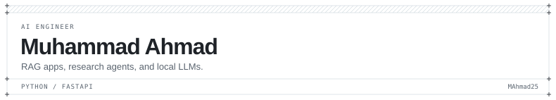
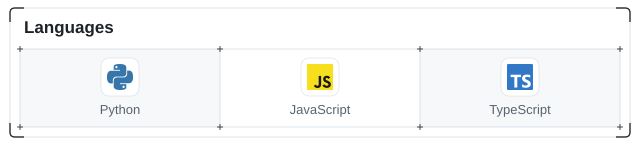
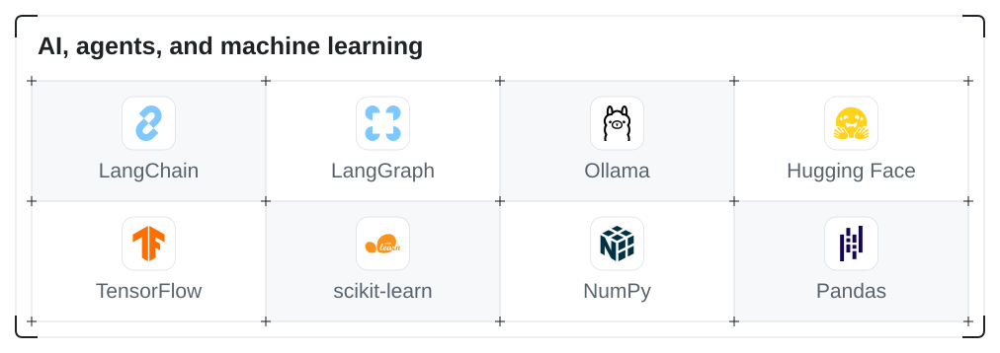
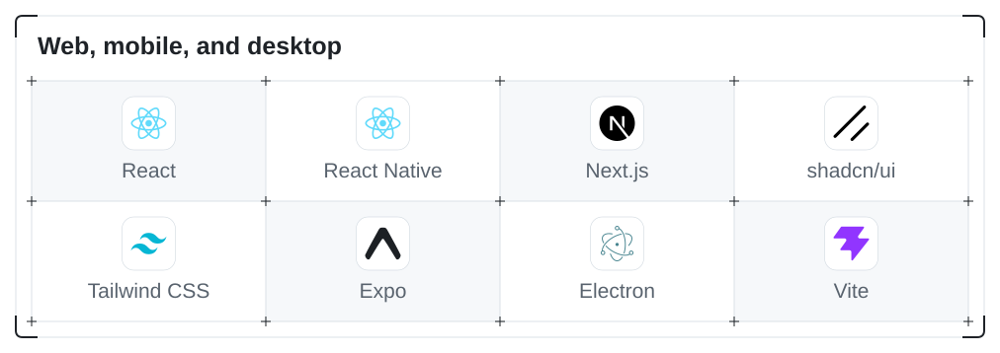
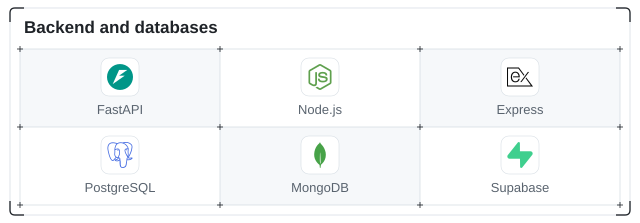
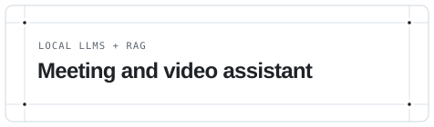
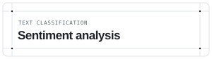
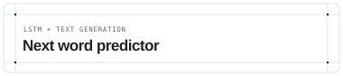
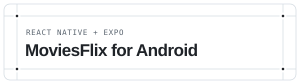

<!-- Profile graphics are included in assets/profile. -->

<table width="100%">
<tbody>
<tr>
<td colspan="3">
<picture>
  <source media="(prefers-color-scheme: dark)" srcset="./assets/profile/frame-top-dark.svg">
  
</picture>
</td>
</tr>
<tr>
<td width="6" valign="top"></td>
<td width="640">

<picture>
  <source media="(prefers-color-scheme: dark)" srcset="./assets/profile/header-dark.svg">
  <source media="(prefers-color-scheme: light)" srcset="./assets/profile/header-light.svg">
  
</picture>

  

<picture>
  <source media="(prefers-color-scheme: dark)" srcset="./assets/profile/separator-dark.svg">
  
</picture>

<picture>
  <source media="(prefers-color-scheme: dark)" srcset="./assets/profile/panel-intro-dark.svg">
  
</picture>

I build AI apps with Python and FastAPI. Most of my recent work is around RAG, research agents, and local LLMs. I also use React and React Native to build the interfaces.

One of my main projects is a desktop meeting and video assistant. It turns audio and video content into reports you can ask questions about, with the models running locally through Ollama.

[Portfolio](https://imahmad.vercel.app) &nbsp; / &nbsp; [Research assistant demo](https://researcharena.vercel.app)

<picture>
  <source media="(prefers-color-scheme: dark)" srcset="./assets/profile/separator-dark.svg">
  
</picture>

### Technical skills

<picture>
  <source media="(prefers-color-scheme: dark) and (max-width: 600px)" srcset="./assets/profile/skills-languages-mobile-dark.svg">
  <source media="(prefers-color-scheme: light) and (max-width: 600px)" srcset="./assets/profile/skills-languages-mobile-light.svg">
  <source media="(prefers-color-scheme: dark)" srcset="./assets/profile/skills-languages-dark.svg">
  
</picture>

<picture>
  <source media="(prefers-color-scheme: dark) and (max-width: 600px)" srcset="./assets/profile/skills-ai-data-mobile-dark.svg">
  <source media="(prefers-color-scheme: light) and (max-width: 600px)" srcset="./assets/profile/skills-ai-data-mobile-light.svg">
  <source media="(prefers-color-scheme: dark)" srcset="./assets/profile/skills-ai-data-dark.svg">
  
</picture>

<picture>
  <source media="(prefers-color-scheme: dark) and (max-width: 600px)" srcset="./assets/profile/skills-web-mobile-mobile-dark.svg">
  <source media="(prefers-color-scheme: light) and (max-width: 600px)" srcset="./assets/profile/skills-web-mobile-mobile-light.svg">
  <source media="(prefers-color-scheme: dark)" srcset="./assets/profile/skills-web-mobile-dark.svg">
  
</picture>

<picture>
  <source media="(prefers-color-scheme: dark) and (max-width: 600px)" srcset="./assets/profile/skills-backend-data-mobile-dark.svg">
  <source media="(prefers-color-scheme: light) and (max-width: 600px)" srcset="./assets/profile/skills-backend-data-mobile-light.svg">
  <source media="(prefers-color-scheme: dark)" srcset="./assets/profile/skills-backend-data-dark.svg">
  
</picture>

<table>
<tr>
<th width="120" align="left">Area</th>
<th width="440" align="left">Languages, frameworks, and tools</th>
</tr>
<tr>
<td width="120" align="left">Languages</td>
<td width="440" align="left">Python, JavaScript, TypeScript, SQL</td>
</tr>
<tr>
<td width="120" align="left">AI and retrieval</td>
<td width="440" align="left">LangChain, LangGraph, ChromaDB, Ollama, Hugging Face</td>
</tr>
<tr>
<td width="120" align="left">Machine learning and data</td>
<td width="440" align="left">scikit-learn, TensorFlow, Pandas, NumPy, Jupyter</td>
</tr>
<tr>
<td width="120" align="left">Backend frameworks</td>
<td width="440" align="left">FastAPI, Node.js, Express</td>
</tr>
<tr>
<td width="120" align="left">Web, mobile, and desktop</td>
<td width="440" align="left">React, React Native, Next.js, shadcn/ui, Tailwind CSS, Expo, Electron, Vite</td>
</tr>
<tr>
<td width="120" align="left">Databases and services</td>
<td width="440" align="left">PostgreSQL, MongoDB, Supabase, Appwrite</td>
</tr>
<tr>
<td width="120" align="left">Development and deployment</td>
<td width="440" align="left">Git, AWS, Vercel</td>
</tr>
</table>
<picture>
  <source media="(prefers-color-scheme: dark)" srcset="./assets/profile/separator-dark.svg">
  
</picture>

### Things I've built

<table>
  <tr>
    <td width="280" valign="top">
      <a href="https://github.com/MAhmad25/Multi-Agent-Research-Assistant">
        <picture>
          <source media="(prefers-color-scheme: dark)" srcset="./assets/profile/card-research-dark.svg">
          
        </picture>
      </a>
      
Searches the web, reads sources, and checks the findings before writing a report. You can follow each step as it runs.

      
Python · FastAPI · LangChain · React

      
<a href="https://github.com/MAhmad25/Multi-Agent-Research-Assistant">Code</a> &nbsp; / &nbsp; <a href="https://researcharena.vercel.app">Live demo</a>

    </td>
    <td width="280" valign="top">
      <a href="https://github.com/MAhmad25/AI-Meeting-Video-Assistant-with-RAG">
        <picture>
          <source media="(prefers-color-scheme: dark)" srcset="./assets/profile/card-meeting-dark.svg">
          
        </picture>
      </a>
      
A desktop app that turns meetings and YouTube content into reports, then answers questions about them using RAG and local models.

      
Electron · FastAPI · LangChain · Ollama

      
<a href="https://github.com/MAhmad25/AI-Meeting-Video-Assistant-with-RAG">Code</a>

    </td>
  </tr>
  <tr>
    <td width="280" valign="top">
      <a href="https://github.com/MAhmad25/Sentiment-Analysis-App">
        <picture>
          <source media="(prefers-color-scheme: dark)" srcset="./assets/profile/card-sentiment-dark.svg">
          
        </picture>
      </a>
      
Type some text and see its predicted sentiment. A trained scikit-learn model handles the prediction behind a FastAPI endpoint.

      
scikit-learn · FastAPI · React · TypeScript

      
<a href="https://github.com/MAhmad25/Sentiment-Analysis-App">Code</a>

    </td>
    <td width="280" valign="top">
      <a href="https://github.com/MAhmad25/Chat_with_Document_RAG">
        <picture>
          <source media="(prefers-color-scheme: dark)" srcset="./assets/profile/card-document-dark.svg">
          
        </picture>
      </a>
      
Upload a PDF and ask questions about it. The app retrieves relevant passages and uses them as context for the answer.

      
FastAPI · LangChain · ChromaDB · Mistral · React

      
<a href="https://github.com/MAhmad25/Chat_with_Document_RAG">Code</a>

    </td>
  </tr>
  <tr>
    <td width="280" valign="top">
      <a href="https://github.com/MAhmad25/Next_Word_Predictor_LSTM_Model">
        <picture>
          <source media="(prefers-color-scheme: dark)" srcset="./assets/profile/card-next-word-dark.svg">
          
        </picture>
      </a>
      
An LSTM trained on Shakespeare's <em>Hamlet</em>. Give it a phrase and it predicts what comes next.

      
TensorFlow · Keras · Streamlit

      
<a href="https://github.com/MAhmad25/Next_Word_Predictor_LSTM_Model">Code</a>

    </td>
    <td width="280" valign="top">
      <a href="https://github.com/MAhmad25/MoviesFlix-Native-Android-App">
        <picture>
          <source media="(prefers-color-scheme: dark)" srcset="./assets/profile/card-moviesflix-dark.svg">
          
        </picture>
      </a>
      
A React Native app for browsing movies and TV shows, exploring cast details, and watching trailers.

      
React Native · Expo · TypeScript · TMDB

      
<a href="https://github.com/MAhmad25/MoviesFlix-Native-Android-App">Code</a>

    </td>
  </tr>
</table>

<picture>
  <source media="(prefers-color-scheme: dark)" srcset="./assets/profile/separator-dark.svg">
  
</picture>

### More projects and experiments

<picture>
  <source media="(prefers-color-scheme: dark)" srcset="./assets/profile/separator-dark.svg">
  
</picture>

#### AI and machine learning

<table>
<tr>
<th width="210" align="left">Project</th>
<th width="350" align="left">What I worked on</th>
</tr>
<tr>
<td width="210" align="left"><a href="https://github.com/MAhmad25/CineSage_Info_Extractor_GEN_AI">CineSage</a></td>
<td width="350" align="left">Extracting movie information from text with an LLM</td>
</tr>
<tr>
<td width="210" align="left"><a href="https://github.com/MAhmad25/SimpleVoiceAgent-with-Eleven-Labs">Voice agent</a></td>
<td width="350" align="left">Speech input and voice responses with ElevenLabs</td>
</tr>
<tr>
<td width="210" align="left"><a href="https://github.com/MAhmad25/HeartDiseases_Prediction_Model">Heart disease prediction</a></td>
<td width="350" align="left">Comparing models on a heart disease dataset</td>
</tr>
<tr>
<td width="210" align="left"><a href="https://github.com/MAhmad25/Ford_car_Price_Prediction_Model">Ford car price prediction</a></td>
<td width="350" align="left">Regression for used car prices</td>
</tr>
<tr>
<td width="210" align="left"><a href="https://github.com/MAhmad25/Movie_Recommendation_Model">Movie recommendations</a></td>
<td width="350" align="left">Content-based recommendations</td>
</tr>
<tr>
<td width="210" align="left"><a href="https://github.com/MAhmad25/CNN-Model">CNN experiments</a> · <a href="https://github.com/MAhmad25/ANN-Model">ANN experiments</a></td>
<td width="350" align="left">Image classification and neural network practice</td>
</tr>
<tr>
<td width="210" align="left"><a href="https://github.com/MAhmad25/Classification-Models">Classification models</a> · <a href="https://github.com/MAhmad25/Sentiment_Analysis_Model_using_NLP">Sentiment model</a></td>
<td width="350" align="left">Training and comparing classifiers</td>
</tr>
<tr>
<td width="210" align="left"><a href="https://github.com/MAhmad25/Unsupervised-Learning">Unsupervised learning</a></td>
<td width="350" align="left">Clustering with K-means and DBSCAN</td>
</tr>
</table>
<picture>
  <source media="(prefers-color-scheme: dark)" srcset="./assets/profile/separator-dark.svg">
  
</picture>

#### Web apps

[MoviesFlix](https://github.com/MAhmad25/TheMoviesFlix-Streaming-Platform) · [AI chat interface](https://github.com/MAhmad25/AI-Chat-Bot) · [Image gallery](https://github.com/MAhmad25/Image-Gallery) · [E-commerce app](https://github.com/MAhmad25/E-commerce-React-App) · [Education platform](https://github.com/MAhmad25/Education-Platform) · [Bank management app](https://github.com/MAhmad25/Bank-Managment-Streamlit)

<picture>
  <source media="(prefers-color-scheme: dark)" srcset="./assets/profile/separator-dark.svg">
  
</picture>

#### Data work

[IPL analysis](https://github.com/MAhmad25/IPL_Matches_Analysis) · [Data visualization](https://github.com/MAhmad25/DataVisualization) · [Feature engineering](https://github.com/MAhmad25/Capstone_Project_Feature_Engineering) · [Feature extraction](https://github.com/MAhmad25/Feature_Extraction_Project) · [Pandas](https://github.com/MAhmad25/Pandas-Data-Learning) · [NumPy](https://github.com/MAhmad25/NUMPY-Math-Learning) · [Statistics](https://github.com/MAhmad25/Statistics)

<picture>
  <source media="(prefers-color-scheme: dark)" srcset="./assets/profile/separator-dark.svg">
  
</picture>

### GitHub stats

  
   
  
  

 

  

  

<picture>
  <source media="(prefers-color-scheme: dark)" srcset="./assets/profile/separator-dark.svg">
  
</picture>

<picture>
  <source media="(prefers-color-scheme: dark)" srcset="./assets/profile/panel-contact-dark.svg">
  
</picture>

If you're working on an AI project and want to compare ideas, feel free to reach out through [my portfolio](https://imahmad.vercel.app).

Grid and separators inspired by <a href="https://efferd.com">Efferd</a> · Project card borders adapted from <a href="https://github.com/Alibey-10/cardcn">Cardcn</a> · Brand icons from <a href="https://simpleicons.org">Simple Icons</a>

</td>
<td width="6" valign="top"></td>
</tr>
<tr>
<td colspan="3">
<picture>
  <source media="(prefers-color-scheme: dark)" srcset="./assets/profile/frame-bottom-dark.svg">
  
</picture>
</td>
</tr>
</tbody>
</table>
